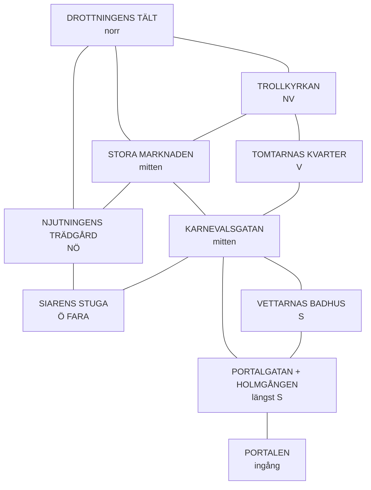

# AI-prompt för Nattmarknadens battle map

**Syfte:** Generera en top-down battle map av hela Nattmarknaden för Foundry VTT.
**Krav:** Ingen text på kartan. Top-down-perspektiv. Dark fantasy, atmosfärisk.

---

## Huvudprompt (Midjourney / DALL-E 3 / Flux)

```
Top-down battle map, no text or labels, dark nordic fantasy
supernatural night market in a forest clearing, oval shape roughly
twice as wide as tall, dense misty forest surrounding the entire clearing,
pine and birch trees bowing slightly inward as if watching,
floating lanterns of blue and green flame hovering above the clearing
casting pools of colored light on the ground, faint red glowing runes
carved into the earth and stone forming a circle around the entire
clearing perimeter (binding runes),

NORTH: a massive living tree throne-pavilion, roots forming a throne,
branches forming a natural canopy, autumn-gold leaves, organic and majestic,
grass clearing around it, (this is the Queen's Tent)

NORTHWEST: a crooked chapel of logs and moss with a tilted pine-cross
on top, stolen church textiles as door curtains (this is the Troll Church)

NORTH-CENTER: a cluster of medieval market stalls of bark, moss and
woven fabric, selling strange goods, roughly 8-10 stalls in rows
(this is the Great Market)

NORTHEAST: a lush garden with impossible colored flowers, a crystal
fountain, winding rose hedges, living wooden benches, soft ethereal
glow (this is the Pleasure Garden)

WEST-CENTER: a cluster of knee-high cottages of moss and birch-bark
with tiny smoking chimneys and miniature vegetable gardens
(this is the Gnomes' Quarter)

CENTER: a carnival alley with red-fabric tents, jugglers platforms,
a fire-eater's circle, a fiddler beside a small stream that shouldn't
be there, a red gambling tent (this is the Carnival Street)

EAST-EDGE: a small cozy hut at the far edge where the lanterns barely
reach, warm yellow light through windows, a single white flame lantern
by the door, several hunched empty-eyed figures sitting motionless
in the grass around it (this is the Seer's Hut - DANGER)

SOUTH-CENTER: a bathhouse built into a grassy hillside, steam rising
from the entrance, two guardian figures at the door (this is the
Vettir Bathhouse)

SOUTH: a wide entrance path lined with stone - FEATURING: a circular
stone arena sunken into the ground, carved stone ring with red glowing
runes around the rim, crowd of creatures gathered around its edges
(this is the Portal Street with the Fighting Ring)

FAR SOUTH: a shimmering gateway of mist where the forest path enters
the clearing, blue-gray fog (this is the Portal - entrance)

painted top-down style, hand-painted digital art, high detail,
soft dramatic lighting from above and from lanterns, rich earth tones
with blue/green/red magical accents, photoshopped battlemap aesthetic,
32x22 grid scale implied but not drawn, no text labels, no grid lines,
no compass, cinematic, atmospheric, dark fantasy tabletop RPG,
2:3 aspect ratio landscape orientation
```

**Negativ prompt (om stödd):**
```
text, labels, words, letters, grid lines, numbers, compass rose,
modern buildings, cars, technology, photorealistic people, anime style,
cartoon, chibi, bright cheerful daylight, sci-fi, cluttered UI elements
```

---

## Layoutreferens (för dig som SL att validera mot)

Detta är mermaid-diagrammet över marknadens geografiska grannar — använd det för att kontrollera att AI-bilden får positionerna rätt:



**Validering mot AI-bilden:**
- Är Drottningens tält längst norr? ✓
- Ligger Holmgången längst söder, nära Portalen? ✓
- Är Siarens stuga vid östra kanten med vit eld? ✓
- Finns runor i marken runt hela gläntan? ✓
- Lyktorna blå/gröna och svävar i luften? ✓

---

## Iterationstips

**Om första bilden är för rörig:**
Lägg till: `clear open walking paths between each area, organized medieval market layout`

**Om bilden är för ljus:**
Lägg till: `low-key lighting, nighttime atmosphere, darkness between lantern pools`

**Om perspektivet är fel:**
Byt ut "top-down battle map" mot: `isometric battle map from above, 3/4 top-down angle`

**För mer "Swedish folklore"-känsla:**
Lägg till: `scandinavian folk art aesthetic, John Bauer forest atmosphere`

**Om du vill ha den som en ASYMMETRISK oval:**
Beskriv: `oval clearing elongated north-to-south, wider in the middle around the Great Market`

---

## Alternativ stil — mer illustrerad

Om du vill ha en karta som mer liknar en **hand-ritad fantasy-karta** snarare än battle map:

```
Hand-drawn fantasy map, top-down view, medieval parchment aesthetic,
dark nordic folklore night market in forest clearing, illuminated
manuscript style, ink and watercolor, individual buildings drawn as
small architectural illustrations, winding paths between areas,
no text no labels, atmospheric fog at edges, red glowing runes
around clearing perimeter, blue and green magical lanterns floating
above, John Bauer meets Tolkien illustration style, 2:3 landscape
```

---

## Praktisk användning i Foundry VTT

1. Generera bilden i 2048x1365 eller högre upplösning
2. Importera som scen-background
3. Skala till 32x22 grid-rutor (eller vad som passar dina tokens)
4. Lägg till walls runt varje byggnad om du vill ha blockerad sikt
5. Plantera lyktor som light sources (blå/grön) för atmosfär
6. Addera dimma längs skogsranden som darkness-layer

**Token-placering:**
- Spelarna startar vid **Portalgatan** (längst söder, nära Holmgången)
- Bergtroll-bröderna **i Holmgången**
- Kvick **bredvid Portalen**
- Knös som skugga vid marknadens ytterkant (var som helst utanför gridet)
