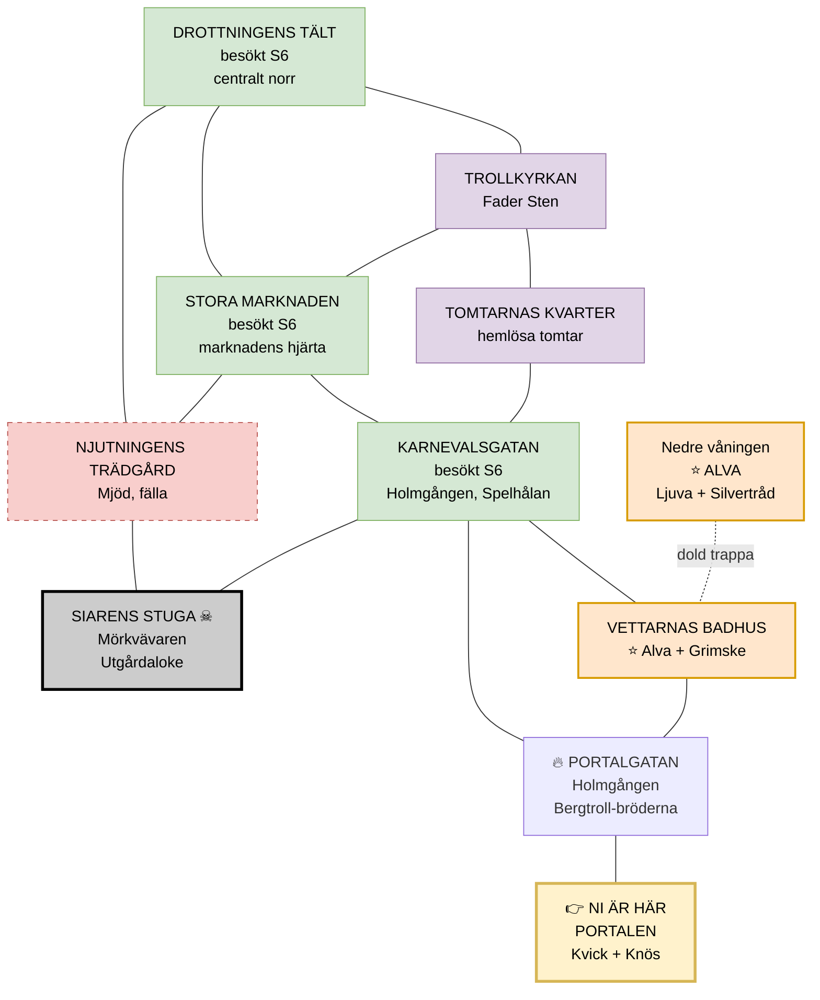

# Session 7 — Nattmarknadens djup

**Datum:** 5 april 2026 (söndag)
**Äventyr:** Nattmarknaden (session 2 av 3). Se `nattmarknaden.md` för fullständigt äventyr.
**Förutsättningar:** Sällskapet fast på marknaden utan skuggmärke. Knös står framför dem. Drottningen har avfärdat dem.
**Uppskattad speltid:** ~3 timmar
**Fokus:** Knös-konfrontation → fri utforskning av marknaden → Alva hittas → huvudplot-ledtrådar → cliffhanger mot Utgårdaloke

---

## Sessionens flöde

```
[1] KNÖS & SKUGGMÄRKET (~15 min)
    Knös närmar sig. Kvick förklarar: de måste förtjäna märket.
    Drottningens outtalade krav: visa er värda.
    │
    ▼
[2] SAMLA INFORMATION (~15 min)
    Kvick leder dem till områden. Nyckelledtrådar droppar:
    "Marknaden sitter fast." "Stugan vid kanten."
    │
    ▼
[3] FRI UTFORSKNING (~90 min)
    Spelarna väljer var de går. Alla 8 områden tillgängliga.
    Kvick guidar på förfrågan, men sätter inte agendan.
    │
    ▼
[4] ALVA HITTAS & BEFRIAS (~30 min)
    Antingen via våld, handel, eller förhandling.
    Alva berättar om Utgårdaloke.
    │
    ▼
[5] HUVUDPLOT-LEDTRÅDAR (~15 min)
    Bindningsrunorna, jötunmagin, "stugan vid kanten".
    │
    ▼
CLIFFHANGER: Spegeln i Siarens stuga.
    DEFAULT: Sällskapet närmar sig stugan när dimman tätnar.
```

---

## Snabbreferens — Vad du behöver ha redo

### Del 1: Knös & skuggmärket (öppning)

**VIKTIGT — Öppna snabbt.** Session 6 tog för lång tid att dra igång. Starta med Knös-scenen direkt, inget smalltalk.

Läs upp (ungefär):
> *Knös rör sig närmare. Inte snabbt — långsamt, som ett berg som bestämt sig för att flytta på sig. Marken vibrerar svagt under hans steg. Två oxar på varandra, sa Kvick. Han underdrev.*
>
> *Kvick kliver mellan er. Liten, ängslig, men modig.*
>
> *"Vänta! Vänta, Knös! De är gäster! De är mina!"*
>
> *Knös stannar. Tittar ner på Kvick. Sedan på er. Sedan tillbaka på Kvick.*
>
> *"Ingen strid,"* säger Knös. Rösten är som stenar som slipas mot varandra. *"Reglerna står."*
>
> *Han vänder och går. Marken suckar av lättnad.*

**Kvicks förklaring:**
- Skuggmärket måste *förtjänas* — man kan inte köpa det
- Drottningen ger det till dem som hjälpt marknaden
- *"Hon vet att ni kan hjälpa. Men hon kan inte be. Hennes lagar."*
- **Kvick nämner outsourced antydningar:** *"Marknaden mår inte bra. Nåt håller oss fast. Hon vet vad. Hon kan inte säga."*

### Del 2: Samla information

**Kvick som guide** (1 silver/timme, redan betald från S6). Han *vill* hjälpa — men kan inte säga allt rakt ut.

Pusha ledtrådar från NSC:er spelarna redan mött:
- **Rotknippet-kvinnan** (om de handlar med nyheter): *"Vi borde ha rest vidare. Någon har ristat runor i marken runt gläntan. Bindningsrunor."*
- **Kvick direkt:** *"Stugan vid kanten. Jag går inte dit. Ingen av oss går dit."*

**Plantera Alva-spåret:**
- Kvick hör sången från Vettarnas Badhus: *"Älvorna sjunger ibland. Vackert. Sorgset. Det är nytt."*
- Om de nämner Alva specifikt: Kvick skakar på huvudet. *"Ingen människa Alva. Men... älvor... har ibland namn som låter mänskligt."*

### Del 3: Marknadens områden — spelarna väljer fritt

Alla 8 områden är tillgängliga. Låt spelarna välja. Kvick guidar dit de pekar, och kan föreslå om de frågar — men sätter inte agendan.

**Narrativ tyngdpunkt:** Alva finns i Vettarnas Badhus. Huvudplot-ledtrådarna (bindningsrunor, "stugan vid kanten", jötunmagi) ska helst nå spelarna innan cliffhangern — de kan samlas från vilket område som helst om SL är mer aktiv.

Områden nedan i ungefärlig karta-ordning (se `nattmarknaden.md` Del 3.3). **Full detalj finns i nattmarknaden.md Del 4.**

**Snabbreferens — alla områden:**

| # | Område | Nyckelperson(er) | Sidouppdrag | Huvudplotledtråd? |
|---|--------|------------------|-------------|-------------------|
| 1 | Stora Marknaden | Runristaren, Rotknippet | — | ✅ Jötunrunor + runor i marken |
| 2 | Karnevalsgatan | Näcken, Eldätaren, Skuggflickan | Lögnarkungen (Finn) | ✅ "Stugan vid kanten" |
| 3 | Njutningens Trädgård | Mjöd | Fångad i trädgården (Finn) | ✅ Avslöjar Utgårdaloke |
| 4 | Trollkyrkan | Fader Sten | Sörens tro + Trons Eld | — |
| 5 | Tomtarnas Kvarter | Grötrik, Lillemor, Skymning | Hemlösa tomtar | ✅ Bindningsrunor + Dannemora |
| 6 | Vettarnas Badhus | Alva, Grimske | Befria älvorna (huvudspår) | ✅ Ljuvas profetia |
| 7 | Siarens Stuga ☠ | "Mörkvävaren" | (klimax i S8) | ✅ Direkt (vit eld, skuggvandrare) |
| 8 | Drottningens Tält | Drottning Halvmåne | — | ✅ Bekräftar allt |
| 9 | **Portalgatan** (ingångsgata) | Holmgången + publik | **Drop-in strid** | — |

---

### Marknadens layout — kopplingar mellan områden

**Spelarnas nuvarande position:** Vid Portalen, efter försök att lämna marknaden. Kvick står bredvid. Knös närmar sig.

**OBS:** Diagrammet visar fysisk *intilliggning* (vilka områden som ligger bredvid varandra). Marknaden är en öppen plats — spelarna kan röra sig **fritt** genom gångarna mellan alla områden. Linjerna är inte tvångspassager.



**Fysiska grannar (norr–söder, väst–öst):**

| Område | Grannar |
|--------|---------|
| Drottningens Tält (centralt norr) | Trollkyrkan, Stora Marknaden, Njutningens Trädgård |
| Trollkyrkan (nordväst) | Drottningens Tält, Stora Marknaden, Tomtarnas Kvarter |
| Stora Marknaden (mitten) | **alla sex** mittenområden (marknadens hjärta) |
| Njutningens Trädgård (nordöst) | Drottningens Tält, Stora Marknaden, Siarens Stuga |
| Tomtarnas Kvarter (sydväst) | Trollkyrkan, Karnevalsgatan |
| Karnevalsgatan (mitten söder) | Stora Marknaden, Tomtarnas Kvarter, Siarens Stuga, Vettarnas Badhus, Portalgatan |
| Siarens Stuga ☠ (sydöst) | Njutningens Trädgård, Karnevalsgatan |
| Vettarnas Badhus (söder) | Karnevalsgatan, Portalgatan |
| Portalgatan (ingångsgata) | Karnevalsgatan, Vettarnas Badhus, Portalen |
| Portalen (ingång, längst söder) | Portalgatan |

**Praktiskt:** Spelarna kan säga *"vi går till Drottningens Tält"* och de kommer dit direkt — de behöver inte stega sig genom varje mellanrum. Diagrammet visar bara fysisk närhet (t.ex. om de smyger runt ytterkanten eller rör sig öppet).

**Färgkodning:**
- 🟡 **Gul** = Spelarnas nuvarande position (Portalen + Kvick)
- 🟢 **Grön** = Besökt i session 6 (översiktligt kända)
- 🟠 **Orange** = Sessions huvudmål (Alva)
- 🔵 **Blå** = Handelsstånd på Stora Marknaden
- 🟣 **Lila** = Social/rollspels-område
- 🔴 **Röd** = Strid / fara
- ⚫ **Grå** = Klimax (spara till S8)

**Kopplingar förklaringsmässigt:**
- Portalen är ingången — härifrån syns Karnevalsgatan direkt, Stora Marknaden är genomgångspunkt, Vettarnas Badhus ligger nära
- Stora Marknaden är **marknadens hjärta** — härifrån når man allt annat
- Siarens Stuga ligger vid marknadens yttersta kant — *"där ljusen knappt når"*
- Alvas hemlighet (nedre våningen) är dold under Vettarnas Badhus

---

#### Stora Marknaden (delvis besökt S6)

**Besökta S6:** Rotknippet-kvinnan (nyheter), Skymningssmide (svartjärn), Paddköpmannen (stulna varor), Svamphandlaren, bifolket med honung.

**Ospelat:**
- **Runristaren** — blind vittra. Ristar skyddsrunor (+🟦 vs övernaturligt, 1 scen) eller kunskapsrunor (svar på en fråga). Pris: droppar blod.
- **Huvudplotledtråd:** Om de visar honom halvmånestenen (Finns ficksten): *"Jötunrunor. Inte häxkonst. Jättemagi. Urgammal."*

**Rotknippet-ledtråd (om nyhet byts):** *"Vi borde ha rest vidare. Någon har ristat runor i marken runt gläntan."*

---

#### Karnevalsgatan

**Näckens Scen:** Fiolspelare i bäcken. Alla som lyssnar: Discipline Lätt ◆ eller förlora sig en timme i behaglig dröm.

**Eldätaren:** Underhållning, inga slag. **Huvudplotledtråd** om de pratar: *"Stugan vid kanten. Gå inte dit. Han som bor där... han tar det ni inte visste att ni hade."*

**Spelhålan — Lögnarkungen (Finns moment):**

Tre rundor, Deception mot ökande svårighet.

| Runda | Motståndare | Svårighet |
|-------|-------------|-----------|
| 1 | Räven, Mossskägg, Skuggflickan | Genomsnittlig ◆◆ |
| 2 | Räven + Skuggflickan (halvfinal) | Svår ◆◆◆ |
| 3 | Skuggflickan (final) | Svår ◆◆◆ + ⬛ |

**Vinst:** 30 silver + **Lögnarkung-titeln** (alla priser -50%, respekt). Triumf: Drottningen skickar efter honom personligen.

---

#### Njutningens Trädgård

**Mjöd — Trädgårdsmästaren** (kön skiftar). Vacker, farlig som djupt vatten. Njutningen är äkta; fällan är att den aldrig slutar.

**Trädgårdens Frid:** ⬛⬛ på alla Discipline-slag för att lämna trädgården.

**Första skiktet (bänkar, frukt):** Sitt 10 min → återställ ALL strain. Discipline Genomsnittlig ◆◆ för att gå. Misslyckande: stannar en timme till, nytt slag Svår ◆◆◆.

**Sidouppdrag: Fångad i trädgården.** Trigger: Kvick (eller annan NSC) fastnar. Mjöd utmanar **Finn** specifikt i "Tre lögner och en sanning" (bäst av tre, Deception Svår ◆◆◆). Se `nattmarknaden.md` Sidouppdrag #3.

**Vinst:** Mjöds ros (engångs autosuccess på Charm). Triumf: Mjöd avslöjar: *"Siaren vid kanten... han är inte vad han ser ut att vara. Något äldre. Farligare."*

---

#### Trollkyrkan (sett S6, ej interagerat)

Fader Sten, 3m skogstroll, fascinerad av kristendomen. Hoc est corpus trollum. Dopet med sumpvatten: *"...i Sonen och Fadern och den Heliga... Svampen?"*

**Sidouppdrag: Sörens tro (ren rollspel).**

| Val | Konsekvens |
|-----|-----------|
| Förstör kyrkan | Bryter marknadsfreden → Knös. Eller: Fader Sten gråter, samvetet gnager |
| Undervisa Fader Sten | Charm Svår ◆◆◆. **Återställ 3 strain** (tron stärks paradoxalt). Triumf: Fader Sten gråter av tacksamhet |
| Ignorera | ⬛ på nästa Discipline-slag |

**Efter Trollkyrkan — Frestelsen Trons Eld:** En vittra erbjuder en flaska med inristat kors. *"Dina böner får kraft. Priset: ditt tvivel."* Discipline Svår ◆◆◆.
- **Om han dricker:** +🟦🟦 på Discipline/Leadership, men **kan aldrig slå Charm** (predikar alltid). Tvivlet = hans mänsklighet.

---

#### Tomtarnas Kvarter

Hemlösa gårdstomtar. Lugnaste platsen på marknaden.

**NSC:er:**
| Tomte | Vill |
|-------|------|
| **Grötrik** | En gård. Vad som helst. Tak över huvudet |
| **Lillemor** | Följa med ut — aldrig träffat mänskor förut |
| **Skymning** | Att mänskor ska veta vad som händer |

**Sidouppdrag: Hemlösa tomtar.** Om sällskapet erbjuder en plats (Anders kyrka, Gretas stuga) åt Grötrik: han gråter. **Ger Lyckosten** (+🟦 på valfritt slag, engångs).

**Huvudplotledtråd (Skymning):** *"Marknaden stannar aldrig så här länge. Något håller fast oss. Jag har hört rykten om runor i marken — bindningsrunor, runt hela gläntan."*

**Kampanjinformation (Skymning):** *"Vi flydde skogarna norr om Tierp för tre månader sedan. Ljusen rör sig söderut. Något gammalt. Och marken skakar vid Dannemora."*

---

#### Vettarnas Badhus (Alva finns här)

**Alva är här.** Gretas lärares lärare, fångad i järnhalsband, dräneras på helande magi.

Se `nattmarknaden.md` Del 4, Område 6 för full detalj.

**Övre våningen:** Tre älvor i järnhalsband. Leenden som inte når ögonen. Perfekt fasad.

**Upptäcka sanningen (halsbanden = kedjor):**
| Metod | Slag |
|-------|------|
| Observera massage/sällskap | Perception Genomsnittlig ◆◆ — ögonen tittar *neråt* |
| Lyssna vid väggarna | Perception Svår ◆◆◆ — sång under golvet |
| Observera vettarna | Vigilance Genomsnittlig ◆◆ — dold dörr |
| Undersöka halsbanden | Skulduggery eller Knowledge Genomsnittlig ◆◆ — järn, kontrollmagi |

**Nedre våningen:** Tre utslitna älvor i nischer. **Alva = Gretas lärares lärare.** Svagast av alla.

**Grimske (Rival):** Br 3, Ag 4, Soak 5, Wounds 16. Järnklor (Br+2, Crit 3, Pierce 1, Ensnare 1). + 4 vettarvakter (minions).

**Alternativ att lösa:**
| Metod | Följd |
|-------|-------|
| Våld | Bryter marknadsfreden → Knös kommer inom 2–3 rundor. Hitta nyckeln (Skulduggery ◆◆) |
| Köpa fri | 150 silver för alla tre. Grimske säljer motvilligt |
| Förhandla via Drottningen | Negotiation Formidabel ◆◆◆◆. Kräver bevis på att fångenskap bryter marknadslagen |
| Spara till session 8 | Drottningen befriar dem retroaktivt om spelarna löser Utgårdaloke först |

**Alvas gåva (vid befrielse):** Kristall. +🟦🟦 på Medicine. Engångs-fullhelning. *"Ge denna till Greta. Säg att Alva minns."*

**Ljuvas profetia (kampanjavbindning):** *"Gruvan. Sången. Det som sover under Dannemora. Tre ankare håller det fast."* (Sätter upp session 8 + framtida äventyr.)

**Lusses frestelse:** En vettar erbjuder att uppgradera Jägarens Öga — priset är att Lusse inte ser älvornas nöd. Discipline Genomsnittlig ◆◆.

---

#### Siarens Stuga — Mörkvävaren ☠

**Sessionens fara-område.** Här bor Utgårdaloke under masken "Mörkvävaren". Om spelarna går in för tidigt = risk att de förlorar själsdelar (⬛ på Willpower tills de lämnar).

**Utsidan:** Vit eld vid dörren (enda vita elden på marknaden). Skuggvandrare sitter tomt i gräset. Dörren står på glänt.

**Om de går in:**
- Spegel av svart glas
- *"Välkomna. Jag har väntat. Alla kommer till slut."*
- Varje PC ser sin djupaste önskan (Sören hel i tron, Finn rik & älskad, Lusse perfekt jägare)
- **Discipline Svår ◆◆◆** för att se bort. Misslyckande: 3 strain + ⬛ på alla Willpower tills de lämnar

**Att genomskåda honom (genast eller vid återbesök):**
- Perception Svår ◆◆◆: Spegeln visar något annat än deras ansikten
- Knowledge Forbidden Genomsnittlig ◆◆: Vit eld = själeld. Runorna = jötunrunor
- **SL-val:** Avslöja honom redan nu eller hålla kvar illusionen till session 8?

**Rekommendation:** Låt dem *besöka* men undvik strid. Cliffhanger kan vara att stugan öppnar sig mot dem.

---

#### Drottningens Tält (besökt S6)

Drottningen sitter på sin trontext. Löven skiftar färg efter hennes humör.

**Om de återkommer efter att ha samlat ledtrådar:**
> *"Jag vet vad som håller oss fast. Jag vet vem. Men mina lagar... alla på min marknad har gästrätt. Även parasiter."*
>
> *"Jag. Kan. Inte. Bryta. Mina. Egna. Lagar."*
>
> *"Men ni... ni är inte bundna av mina lagar."*
>
> Löven glittrar guldgula ett ögonblick.
>
> *"Om någon — helt av egen vilja — skulle lösa det som ligger tungt över min marknad... skulle jag vara mycket uppskattsam. Sådana gärningar glöms inte bort på Nattmarknaden."*

**Ger inte rakt ut svaret.** Antyder starkt, fascineras, bekräftar. Hon **ber aldrig**, men hon gör det tydligt att generös tacksamhet väntar den som agerar av egen drift. Spelarna måste fortfarande själva koppla ihop pusslet (vem? var? hur?).

**Om Finn vunnit Lögnarkungen:** Hon skickar efter honom. *"Silvertungan. Imponerande. Stanna, om ni vill. Min marknad har plats."*

---

#### 🔥 Portalgatan & Holmgången — Drop-in strid (reglerad)

**Plats:** **Portalgatan** är den breda ingångsgatan precis innanför Portalen. Gatan leder norrut mot Karnevalsgatan och österut mot Vettarnas Badhus. Här ligger **Holmgången** — en arena av huggen sten med runor som glöder svagt röda. Detta är marknadens **enda ställe där strid är tillåten**. Knös övervakar från avstånd. Bortfallna stabiliseras automatiskt.

Eftersom Portalgatan är ingångsgatan passerar de flesta besökare Holmgången när de kommer in eller lämnar marknaden — det är marknadens första *och* sista intryck.

**Motståndarna — Vad spelarna ser:**

> *Tre bröder. Korta jämfört med troll, ungefär två meter, men breda som tunnor. Hud som pimsten — grå och sprucken, med ådror av grönt och rött som pulserar svagt. Ögon som skiftande kristaller: gula, orange, röda. Luggen är matt av kolsmuts och stendamm. Kläderna är läder och järnbeslag, slitna av gruvarbete. De ser ut som stenen själv lärt sig att gå.*

**Vad de är:** **Bergtroll-bröder från Dannemora.** Unga, vuxna för sin sort. Fördrivna från sitt hem för månader sedan av "något som vaknade". De har hamnat på marknaden eftersom de inte har någonstans att ta vägen. Aggressiva, stolta, bitterläppade. **Inte onda** — bara trötta och provokativa. De vill bevisa sig.

**Att identifiera dem (passiva kunskapsslag):**

| Slag | Svårighet | Vad spelaren får veta |
|------|-----------|----------------------|
| Knowledge (Lore) | Lätt ◆ | Bergtroll. Lever i gruvor och berg. Grövre än skogstroll, inte lika sluga som vittror |
| Knowledge (Lore) | Genomsnittlig ◆◆ | Bergtroll är stolta krigare. Tvekar sällan att utmana. De har bröderskapskoder — den som försmår en bror försmår alla tre |
| Knowledge (Forbidden) | Genomsnittlig ◆◆ | *"Dannemora? Det är en gruvort norr om Tierp. Folk säger att marken skakar där. Bergtroll brukar inte lämna sina gruvor — något har drivit ut dem."* |
| Sörens inkvisitions-bakgrund | +🟦 på ovanstående | Han har sett protokoll om bergtroll. De räknas som "oknytt av mindre hot" — men tre samtidigt är ovanligt |

**SL-notering:** Dannemora är planterat i Ljuvas profetia (session 7–8) och i Skymnings ord (Tomtarnas Kvarter). Att bröderna kommer DÄRIFRÅN är en tyst föraning — spelarna ska märka det men inte nödvändigtvis koppla ihop allt ännu.

**Deras personligheter:**
- **Grimtand** (den största) — aggressiv, snabb att utmana, högljudd. *"Vi slogs mot varje oknytt från Dannemora till Hofors. Ni ska få se hur en riktig brottare gör."*
- **Lurkna** (den smala) — listig, hånfull, gillar att provocera med ord. *"Mänskor är som sparrisar. Går av på minsta tryck."*
- **Bullrik** (den tjocka) — tyst, fåmäld, förlitar sig på sin storlek. Säger bara korta fraser. *"Slag. Hård."*

**När du vill trigga:** När en PC *kliver över tröskeln från Portalen* in på Portalgatan. Bröderna står redan i ringen och jagar ögonkontakt med nyanlända. När spelaren möter deras blick — eller råkar kliva nära ringens sten-kant — hoppar de på. Eftersom Portalgatan ligger mellan Portalen och resten av marknaden är detta praktiskt taget oundvikligt så fort någon rör sig.

**Läs upp (när de närmar sig):**

> *Ett sorl av röster drar er blick. På Portalgatan, bara några steg innanför ingången: en ring av huggen sten, handflatsdjup, med runor som glöder svagt röda. Publik trängs runt kanten — trollungar som hojtar, vittror som slår vad, en fiolspelare som slår en takt. Och i mitten: tre bergtroll-bröder, breda som tunnor, står med armarna i kors och grinar.*
>
> *Den största — gröna ränder över bröstet, tänder som filats till spetsar — pekar på er.*
>
> *"MÄNSKOR!"* ropar han. Publiken jublar. *"Äntligen något roligt! Kom in i ringen! Tre mot tre! Eller är ni rädda?"*

**Provokationshaken (välj en — eller kombinera):**

| Hak | Riktas mot | Vad sägs |
|-----|-----------|----------|
| Spjutet | **Sören** | *"Präst-pinnen! Låt oss se om den biter när ingen ber för dig!"* |
| Dolken | **Finn** | *"Den där skuggdolken... den var vår, en gång. Vi vill ha den tillbaka. Kom vinn den!"* |
| Amuletten | **Lusse** | *"Jägare med talisman? Skrattretande. En riktig jägare behöver inte smycken."* |
| Emma | **Allmänt** | *"Ni släpar en flickunge genom farlig mark. Lär er försvara henne. Visa oss."* |

**Regler i ringen (marknadsmagi):**
- **Ingen dör.** PC som går till 0 wounds → knockout, stabiliseras automatiskt efter striden
- Kritiska träffar gäller, men de som normalt skulle döda → medvetslöshet istället
- **Vapen tillåtna.** Detta är inte en knytnävsslagsmål om spelarna inte vill
- **Ingen flykt.** Runringens magi håller kämparna inom ringen tills någon sida är nere

**Action economy — hur tre mot tre fungerar:**

Grimtand **fixerar** en spelarkaraktär (troligen den han provocerade). Lurkna och Bullrik **försöker flanka** den utvalda PC:n om ingen stoppar dem.

> *"Ni andra två. Håll bröderna borta. Annars blir det tre mot en där inne."*

**Mekanik — Engagera partnerna:**
- PC som vill hindra Lurkna/Bullrik från att nå huvud-PC:n: **Athletics eller Coordination Genomsnittlig ◆◆** för att fånga dem i engaged. Sedan normal strid.
- Om PC:n misslyckas: vittran tar sig runt dem och assisterar Grimtand → ⬛ till den flanke-ade PC:n.
- Om lyckad: striden delar sig i 1v1 + 2v2 (eller tre separata dueller).

**Motståndare:**

**Grimtand** (Rival — ledaren)
| Egenskap | Värde |
|----------|-------|
| Br 4 \| Ag 2 \| Int 2 \| Cu 3 \| Wi 2 \| Pr 2 |
| Soak 4 \| Wounds 12 |
| Skills: Brawl 3, Coercion 2, Resilience 2 |
| Talanger: Adversary 1 |
| Vapen: Nävklubba (Br+2, Crit 4, Disorient 1, Knockdown) |
| Förmåga: **Slagregn** — en gång per strid, två Brawl-attacker samma runda som en action |

**Lurkna** (Rival — snabb)
| Egenskap | Värde |
|----------|-------|
| Br 2 \| Ag 4 \| Int 2 \| Cu 3 \| Wi 2 \| Pr 2 |
| Soak 3 \| Wounds 10 |
| Skills: Brawl 3, Stealth 3, Coordination 2 |
| Vapen: Klor (Br+1, Crit 3, Accurate 1) |
| Förmåga: **Flankrörelse** — kan flytta från Engaged utan fri attack en gång per strid |

**Bullrik** (Rival — muskelklump)
| Egenskap | Värde |
|----------|-------|
| Br 4 \| Ag 1 \| Int 1 \| Cu 2 \| Wi 2 \| Pr 1 |
| Soak 5 \| Wounds 12 |
| Skills: Brawl 3, Intimidation 2 |
| Vapen: Stenslag (Br+2, Crit 5, Concussive 1) |
| Förmåga: **Stenhud** — tar halv skada från första träffen i striden |

**Action economy:** 3 vs 3 (4 inklusive Emma). Grimtand är farligast (Adversary 1 = 1 ⬛ på attacker mot honom). Lurkna vinner på snabbhet. Bullrik tål stryk. **Total wounds: 34** (justerat från 38). Beräknad stridslängd: 3–4 rundor.

**Vinst:**
- **FULL helning** (wounds + strain) för hela sällskapet — marknadsmagin
- 30 silver + en **Rödögd Sten** (kastas i eld: ger ⬛ till alla fiender i short range en runda, engångs)
- Publiken jublar. Ryktet sprider sig — *"mänskorna slog Grimtands bröder"*
- Kvick ler brett: *"Ni är inte helt hopplösa, va?"*

**Förlust:**
- Full helning ändå (marknadens regel)
- Förlorar 20 silver som insats
- Ryktet sprids åt andra hållet — ⬛ på Intimidation-slag resten av sessionen
- Vittrorna bjuder på en drink: *"Ni gjorde bra ifrån er. För mänskor."*

**Terrifying-kontroll:** Grimtand har Fear 1 på grund av sina filade tänder och kroppsstorlek. PC:erna slår **Discipline Lätt ◆** vid strids första runda. Misslyckande: 2 strain.

---

### Del 4: Huvudplot-ledtrådarna — SL-referens

**Målinsikt spelarna ska nå:**

> **Marknaden är fjättrad av bindningsrunor runt gläntan. Runorna är jötunmagi. Kraften leder till stugan vid kanten — där "Mörkvävaren" bor.**

Tre kärninsikter leder dit:
1. **Marknaden är fast** (3+ källor)
2. **Någon håller den fast med jötunmagi** (2+ källor)
3. **Boven bor i stugan vid kanten** (3+ källor)

#### De 5 kärnledtrådarna — Three Clue Rule

Spelarna behöver bara träffa **3 av 5**. Du har alla fem som säkerhet.

| # | Ledtråd | Källa | Hur triggas | Vad de får veta |
|---|---------|-------|-------------|-----------------|
| 1 | **Runor i marken** | Rotknippet-kvinnan (Stora Marknaden) | Handlar med nyheter som betalning | *"Vi borde ha rest vidare för veckor sedan. Någon har ristat runor i marken runt hela gläntan. Bindningsrunor."* |
| 2 | **Marknaden är fast** | Skymning (Tomtarnas Kvarter) | Pratar lugnt med dem | *"Marknaden borde ha rest vidare. Något håller fast. Rykten om runor i marken."* |
| 3 | **Stugan vid kanten** | Eldätaren (Karnevalsgatan) | Prata med honom efter föreställningen | *"Stugan vid kanten. Gå inte dit. Han som bor där... han tar det ni inte visste att ni hade."* |
| 4 | **Jötunmagi** | Runristaren (Stora Marknaden) | Visa halvmånestenen (Finns ficksten) | *"Jötunrunor. Inte häxkonst. Jättemagi. Urgammal."* |
| 5 | **Tre ankare** | Ljuva (Vettarnas Badhus nedre) | Efter att Alva befriats | *"Gruvan. Sången. Det som sover under Dannemora. Tre ankare håller det fast. Bryt dem — eller allt brinner."* |

#### Bonusledtrådar (kan aktiveras när som helst)

| Källa | Ledtråd |
|-------|---------|
| **Kvick** (guide, alltid med) | *"Stugan vid kanten. Jag går inte dit. Ingen av oss går dit."* |
| **Kvick** (om de frågar om skuggvandrarna) | *"De där i gräset runt stugan? De var levande för en vecka sedan."* |
| **Drottningen** (vid återbesök) | *"Jag vet vem. Men mina lagar... Om någon, av egen vilja, skulle lösa det — skulle jag vara mycket uppskattsam."* |
| **Mjöd** (Njutningens Trädgård, om Finn vinner) | *"Siaren vid kanten... han är inte vad han ser ut att vara. Något äldre. Större. Farligare."* |
| **Paddköpmannen** (om de ser runorna i fickan hos dem) | *"Har ni sett runor i marken? De lyser när mörkret är tätt. Ganska vackra."* |
| **Silvertråd** (i nedre Badhuset) | *"Han hungrar. Han har alltid hungrat. Nu svälter han marknaden."* |

#### Fysiskt bevis — Bindningsrunorna

Om spelarna går till **gläntans ytterkant**:
- **Perception Genomsnittlig ◆◆** → *"I mossan, knappt synliga: inristade symboler. Svagt glödande, rödaktiga. Löper i en ring runt hela gläntan."*
- **Knowledge Forbidden Svår ◆◆◆** → *"Det här är bindningsrunor — uråldriga, kraftfulla. Energin leder mot stugan vid kanten."*

#### Plan B — om spelarna är borta

**Om spelarna inte pratar med NSC:er:**
Kvick kan spontant säga: *"Folk pratar mer än vanligt idag. Nyhetshandlaren vet sånt man inte får veta. Har ni märkt att marken lyser lite där borta vid skogsranden?"*

**Om spelarna fokuserar bara på Alva:**
Silvertråds muttrande vid befrielse blir din säkra länk till huvudploten.

**Om de inte besöker Drottningen:**
Kvick: *"Om ni vill ha märket är Drottningen enda vägen. Hon kan inte be — men hon ger om ni visar initiativ."*

**Om de inte går till gläntans kant:**
Låt en Trollunge från Trollkyrkan peka och fråga: *"Varför lyser marken där?"*

#### Checklista för SL under spel

```
Minst 3 av 5 kärnledtrådar → redo för session 8

□ Runor i marken        (Rotknippet eller gläntans kant)
□ Marknaden fast        (Skymning eller Rotknippet)
□ Stugan vid kanten     (Eldätaren, Kvick eller Mjöd)
□ Jötunmagi             (Runristaren eller Knowledge-slag vid runorna)
□ Tre ankare            (Ljuva — kräver Alva befriad)
```

När du bockat av **3 av 5** — spelarna har tillräckligt för att agera i session 8.

---

## Emma under session 7

Emma fick mer utrymme i session 6 än förväntat. Bygg vidare:
- **Hon dras till Vettarnas Badhus.** Ögonen tittar neråt. Hon *känner* sången. Säger kanske: *"Någon lider."*
- **Marknadsväsen bugar för henne** (påminnelse från session 6). Paddköpmannen: *"Hon är en av oss, nästan. Intressant."*
- **Om hon passerar Siarens stuga:** Hon stannar. Vägrar. *"Det är kallt där. Det luktar hunger."*

Emma får EJ eget sidouppdrag — hennes roll är "kompass". Witchborn-instinkterna pekar åt rätt håll.

---

## Regelreferenser

| Situation | Regel | Var |
|-----------|-------|-----|
| Frestelser (Trons Eld, Trädgården, Lusses amulett) | Discipline-slag, misslyckande = strain + lockelse | Genesys s. 115 |
| Lögnarkungen | Deception opposed by Discipline eller motståndares Cool/Vigilance | s. 55 |
| Grimske-strid (om våld) | Rival — normala stridsregler. Ensnare 1 = immobilized | s. 108 |
| Bryta marknadsfreden | Knös kommer inom 2–3 rundor. Han är 48 wounds, SPRINGA är enda utvägen | — |
| Halvmånestenen (Finns ficksten) | Jötunruna — Knowledge Forbidden Svår ◆◆◆ för att läsa. Triumf: *"En markör. En lockare."* | — |

**Terrifying-checks:** Kom ihåg att slå dem! Grimske om han aktiveras i strid. Knös om han kommer fram (Terrifying 3 = ◆◆◆ Discipline, strain vid fel).

**Knös-varningen:** Plantera honom 2–3 gånger under sessionen innan han blir hot (lärdom från session 6). *"En skugga passerar. Större än ni trodde möjligt."*

---

## Cliffhanger-förslag

| Om de... | Sluta med... |
|----------|-------------|
| Befriat Alva | Alva viskar Sörens namn. *"Tempelriddaren. Det finns en jätte i stugan. Gå inte. Eller gå — och var redo."* |
| Hittat runorna | Runorna i marken pulserar när Sören stiger nära. Ljusbringaren svarar — blått ljus, första gången. CUT |
| Avslöjat Grimske men ej löst Alva | Knös närmar sig. Marknaden tystnar. Drottningens röst i alla riktningar: *"Ni har intressant er för mina angelägenheter."* |
| Ej gjort huvudploten | Kvick pekar mot stugan. *"Imorgon. Vi pratar med Mörkvävaren imorgon."* Hans leende fladdrar |

**Default-cliffhanger:**
> *Sällskapet står vid marknadens kant. Dimman tätnar. En vit lykta brinner vid en stuga i fjärran — den enda vita elden på hela marknaden.*
>
> *Kvick ryser. *"Ni frågade om stugan. Den är där. Gå inte dit innan ni är redo. Men ni är redo nu, va?"*
>
> *Han ler. Leendet når inte ögonen.*
>
> *Dörren står på glänt.*
>
> *CUT.*

---

## Session 7 — Vad som INTE händer (spara till session 8)

- ❌ Strid mot Utgårdaloke (hela klimax)
- ❌ Förstörelse av bindningsrunorna (kan hittas, men brytande = session 8)
- ❌ Drottningens belöning / skuggmärket (ges när Utgårdaloke är besegrad)
- ❌ Hemkomst till Tierp + tidsförskjutningen
- ❌ Kampen mot skuggvandrarna

---

## Checklista inför spel

- [ ] Läs `nattmarknaden.md` Del 4 (marknadens områden) grundligt
- [ ] Förbered Knös-entrén som öppning — starta SNABBT
- [ ] Förbered Grimske stats + vettarvakter i Foundry (saknas enligt red team)
- [ ] Skapa NPC-markdown/JSON för Grimske om strid sannolik
- [ ] Förbered Alvas kristall som item i Foundry
- [ ] Ha Fader Stens röst redo ("Hoc est corpus trollum")
- [ ] Förbered Lögnarkung-tävlingen (3 motståndare, stats)
- [ ] Förbered Mjöd stats (Njutningens Trädgård) om spelarna drar dit
- [ ] **Förbered Holmgången** — Grimtand, Lurkna, Bullrik (3v3-striden). Provokationshak per PC
- [ ] Karta över marknadens 8 områden (synlig för spelarna)
- [ ] Plantera Knös 2–3 gånger som atmosfärs-element
- [ ] Lista över fem huvudplot-ledtrådar — vilka som delats ut
- [ ] Ljusbringarens signaler (när lyser/pulserar den?)

---

## Sammanfattning av sessionen i ett citat

> *"Min marknad andas. Just nu håller den andan."* — Drottning Halvmåne
